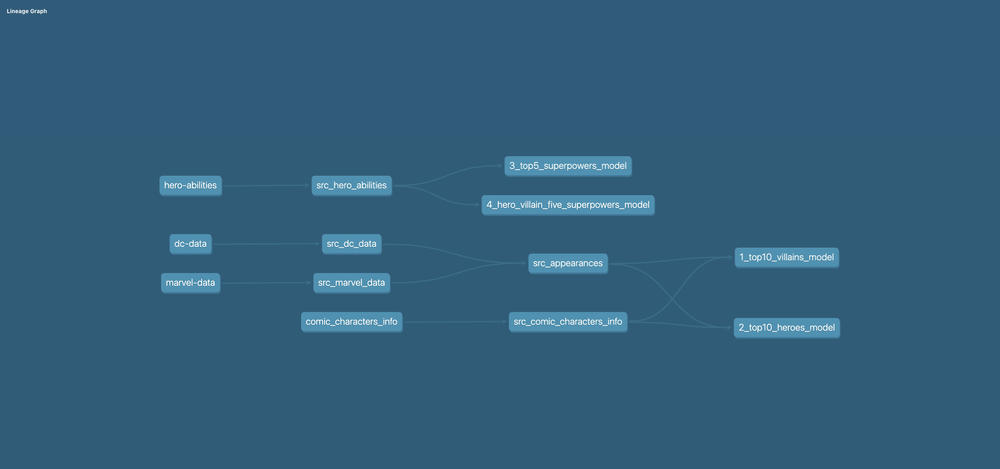

# Superawesome Data Code Challenge

## George Ilie's submissions

This project is a fully automated solution for managing **dbt** workflows with **DuckDB** as the database. It uses **Ansible** for orchestration, ensuring a seamless setup, configuration, and execution process.

### Features

- Automated dbt and DuckDB installation and configuration.  
- Orchestrates the entire dbt workflow using Ansible.  
- Utilizes DuckDB as the database backend for dbt.  
- Portable and easy to share with other developers.  


### Prerequisites

1. **Python**: Version 3.8 or later   
2. **Make**: To execute the `Makefile`  


### How to run it

In the root directory there is a **makefile** that: 
- Creates a virtual environment 
- Installs dbt, DuckDb, ansible, and dependencies
- Copies the .csv files as dbt seeds
- Runs the Ansible playbook for workflow orchestration

In terminal execute:
`make all`

For removing the virtual environment and logs:
`make clean`


### Project Details:

The implementation follows dbt best practices, leveraging Jinja template tags for flexibility and modularity. By utilizing DuckDB, the project ensures seamless integration with dbt, making it highly suitable for Local-First Development while delivering high performance.
Importing the CSVs as dbt seeds and then preparing the source data for the final models. [Source preparation data models.](ansible-dbt-orchestration/playbooks/dbt_super/src/)

**Lineage graph of the dbt implementation.**
Can also be obtained by running **dbt docs serve**.



**The questions in the assessment are resolved in the dbt models as it follows:**

<details>
<summary>Top 10 villains by appearance per publisher 'DC', 'Marvel' and 'other'</summary>

model: [1_top10_villains_model.sql](ansible-dbt-orchestration/playbooks/dbt_super/models/1_top10_villains_model.sql)


|Publisher    |Name           |appearances|
|-------------|---------------|-----------|
|DC Comics    |Joker          |517        |
|DC Comics    |Swamp Thing    |309        |
|DC Comics    |Big Barda      |216        |
|DC Comics    |Gorilla Grodd  |179        |
|DC Comics    |Bane           |157        |
|DC Comics    |Maxima         |124        |
|DC Comics    |Granny Goodness|115        |
|DC Comics    |Black Manta    |95         |
|DC Comics    |Amazo          |71         |
|DC Comics    |Mister Mxyzptlk|64         |
|Marvel Comics|Sabretooth     |382        |
|Marvel Comics|Venom          |371        |
|Marvel Comics|Mephisto       |317        |
|Marvel Comics|Thanos         |317        |
|Marvel Comics|Bullseye       |277        |
|Marvel Comics|Mandarin       |193        |
|Marvel Comics|Ultron         |187        |
|Marvel Comics|Sebastian Shaw |174        |
|Marvel Comics|Hela           |170        |
|Marvel Comics|Dormammu       |132        |


</details>

<details>
<summary>Top 10 heroes by appearance per publisher 'DC', 'Marvel' and 'other'</summary>

model: [2_top10_heroes_model.sql](ansible-dbt-orchestration/playbooks/dbt_super/models/2_top10_heroes_model.sql)

|Publisher    |Name             |appearances|
|-------------|-----------------|-----------|
|DC Comics    |Batman           |3,093      |
|DC Comics    |Superman         |2,496      |
|DC Comics    |Wonder Woman     |1,231      |
|DC Comics    |Aquaman          |1,121      |
|DC Comics    |Flash            |1,028      |
|DC Comics    |Alan Scott       |969        |
|DC Comics    |Alfred Pennyworth|930        |
|DC Comics    |Kyle Rayner      |716        |
|DC Comics    |Guy Gardner      |593        |
|DC Comics    |John Stewart     |549        |
|Marvel Comics|Spider-Man       |4,043      |
|Marvel Comics|Captain America  |3,362      |
|Marvel Comics|Wolverine        |3,062      |
|Marvel Comics|Iron Man         |2,966      |
|Marvel Comics|Thor             |2,259      |
|Marvel Comics|Hulk             |2,019      |
|Marvel Comics|Vision           |1,137      |
|Marvel Comics|Jean Grey        |1,115      |
|Marvel Comics|Emma Frost       |886        |
|Marvel Comics|Luke Cage        |862        |

</details>

<details>
<summary>What are the 5 most common superpowers?</summary>

model: [3_top5_superpowers_model.sql](ansible-dbt-orchestration/playbooks/dbt_super/models/3_top5_superpowers_model.sql)

|superpower    |superpower_count|
|--------------|----------------|
|Agility       |625             |
|Stamina       |587             |
|Super Strength|582             |
|Durability    |557             |
|Reflexes      |483             |

</details>

<details>
<summary>Which hero and villain have the 5 most common superpowers?</summary>

model: [4_hero_villain_five_superpowers_model.sql](ansible-dbt-orchestration/playbooks/dbt_super/models/4_hero_villain_five_superpowers_model.sql)

|name                     |
|-------------------------|
|A-Bomb                   |
|Abe Sapien               |
|Achilles Warkiller       |
|Acidicus                 |
|Alita                    |
|Amazo                    |
|Anacondrai Serpent       |
|Angel Of Death           |
|Angela                   |
|Annihilus                |
|Anti-Spawn               |
|Aquaman                  |
|Aspheera                 |
|Asura                    |
|Attuma                   |
|Azrael                   |
|Balder                   |
|Battlestar               |
|Big Barda                |
|Big Boss                 |
|Bizarro-Girl             |
|Black Bolt               |
|Bloodaxe                 |
|Bor Burison              |
|Brainiac 5               |
|Buffy                    |
|Bumblebee                |
|Buri                     |
|Caesar                   |
|Caliban                  |
|Captain Britain          |
|Captain Mar-vell         |
|Captain Soto             |
|Catwoman                 |
|Cheetah III              |
|Chop'rai                 |
|Commander Blunck         |
|Commander Machia         |
|Corvus Glaive            |
|Cosmic Hulk              |
|Cull Obsidian            |
|Cyborg Superman          |
|Damien Darhk             |
|Dante                    |
|Dark Phoenix             |
|Darth Maul               |
|Darth Nox                |
|Death Seed Draken        |
|Destroyer                |
|Devilman                 |
|Doctor Occult            |
|Donna Troy               |
|Doom Slayer              |
|Doomguy                  |
|Dracula                  |
|Fangtom                  |
|Firestorm                |
|Firestorm II             |
|First Spinjitzu Master   |
|Fëanor                   |
|Gaara                    |
|Gamora                   |
|Garmadon                 |
|General Cryptor          |
|General Kozu             |
|Ghost Rider 2099         |
|Giant Stone Warrior      |
|Goblin Force             |
|Goku                     |
|Golden Ninja             |
|Gorilla Grodd            |
|Grand Master Skywalker   |
|Granny Goodness          |
|Graviton                 |
|Green Lantern            |
|Grid                     |
|Hancock                  |
|Harry Osborn             |
|Heart Of The Monster Hulk|
|Hellboy                  |
|Hive                     |
|Hogun                    |
|Homelander               |
|Honey Badger             |
|Hourman                  |
|Hybrid                   |
|Icon                     |
|Immortal Hulk            |
|Incredible Hulk          |
|Infernal Hulk            |
|Invincible               |
|Iron Baron               |
|Iron Destroyer           |
|John Constantine         |
|Kapau'rai                |
|Karlof                   |
|Kenshiro                 |
|Killian                  |
|Killmonger               |
|Killow                   |
|Kisame                   |
|Kratos                   |
|Kruncha                  |
|Kylo Ren                 |
|Lady Deadpool            |
|Lady Deathstrike         |
|Laira                    |
|Lar Gand                 |
|Lashina                  |
|Legolas                  |
|Life Entity              |
|Lightray                 |
|Lizard                   |
|Lord Garmadon            |
|Lucifer                  |
|Madara Uchiha            |
|Mario                    |
|Martian Manhunter        |
|Mistake                  |
|Mongul                   |
|Mongul The Elder         |
|Morlun                   |
|Mystique                 |
|Nadakhan                 |
|Nagato Uzumaki           |
|Namor                    |
|Namorita                 |
|Naruto Uzumaki           |
|Nightcrawler             |
|Nomad                    |
|Old King Thor            |
|Omega                    |
|Omni-Man                 |
|Percy Jackson            |
|Powerboy                 |
|Proxima Midnight         |
|Puck                     |
|Queen Hippolyta          |
|Ragman                   |
|Raiden                   |
|Reign                    |
|Resurrection Spawn       |
|Reverse Flash            |
|Samukai                  |
|Samurai Mech(Stone Army) |
|Samurai X                |
|Sasuke Uchiha            |
|Scarlet Spider II        |
|Scorpion                 |
|Selene                   |
|Shadow The Hedgehog      |
|Shao Kahn                |
|Shin Godzilla            |
|Shisui Uchiha            |
|Silk                     |
|Skaar                    |
|Skales                   |
|Solid Snake              |
|Songbird                 |
|Sonic The Hedgehog       |
|Spider-Gwen              |
|Spider-Woman             |
|Stargirl                 |
|Steel Serpent            |
|Strange Visitor Superman |
|Supergirl                |
|Symbiote Wolverine       |
|T-X                      |
|Thanos                   |
|The Beyonder             |
|The Crow                 |
|The Executioner          |
|The Goon                 |
|The Great Devourer       |
|The Keeper               |
|The One Below All        |
|The Rival                |
|The Upgrade              |
|Toad                     |
|Tobirama Senju           |
|Ultron                   |
|Ursa Major               |
|Vampire Batman           |
|Venompool                |
|Vergil                   |
|Vili                     |
|Violator                 |
|Vixen                    |
|Vixen II                 |
|Volstagg                 |
|Warpath                  |
|Wesker                   |
|White Wolf               |
|Wonder Girl              |
|World Breaker Hulk       |
|Yang                     |
|Zane                     |
|Zero                     |
|Zoom                     |

</details>

### File Structure:

```
.
├── ansible-dbt-orchestration
│   ├── inventory
│   │   ├── hosts.ini           # Lists of hosts that ansible can manage (localhost only)
│   ├── playbooks
│   │   ├── dbt_super           # DBT project files 
│   │   │   ├── models          # DBT models
│   │   │       └── src         # Preparing data for the final models
│   │   ├   ├── profiles.yaml   # DuckDB configuration   
├── makefile                    # Setup automation
├── README.md                   # Project documentation
├── requirements.txt            # Python package dependencies
└── images                      # Images needed for project documentation
└── challenge_requirements		# Assignment information and files
```
.
├── ansible-dbt-orchestration/playbooks
│   ├── dbt_super                   	# DBT project files  
│       ├── models/  					# DBT models. These address the assignment questions
│       │   └── src/              		# Preparing data for using it in the models
│       └── profiles.yml                # DuckDB configuration   
│   └── dbt_orchestration.yml			# Ansible playbook  					
├
│   └── inventory/  
│       ├── hosts.ini  					# Lists of hosts that ansible can manage (localhost only)
│
│ 
├── challenge_requirements				# Assignment information and files
│
├── makefile                            # Setup automation
├── README.md                           # Project documentation
└── requirements.txt                    # Python package dependencies
└── images                   			# Images needed for project documentation


### Optional:
- For querying the database through DB GUI clients you can use general-purpose database clients such as DBeaver.
- run **dbt docs generate** for generating the dbt objects documentation.
- run **dbt docs serve** for generating a local lightweight server where you can browse the documentation.