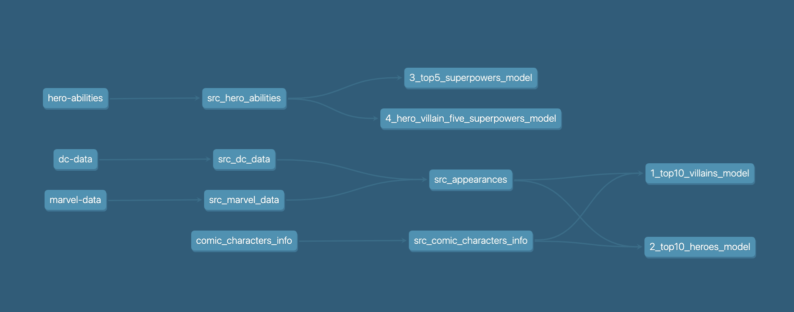

# Superawesome Data Code Challenge

## George Ilie's submissions

This project is a fully automated solution for managing **dbt** workflows with **DuckDB** as the database. It uses **Ansible** for orchestration, ensuring a seamless setup, configuration, and execution process.

### Features

- Automated dbt and DuckDB installation and configuration.  
- Orchestrates the entire dbt workflow using Ansible.  
- Utilizes DuckDB as the database backend for dbt.  
- Portable and easy to share with other developers.  

### Prerequisites

1. **Python**: Version 3.8 or later   
2. **Make**: To execute the `Makefile`  

### How to run it

In the root directory there is a **makefile** that: 
- Creates a virtual environment 
- Installs dbt, DuckDb, ansible, and dependencies
- Copies the .csv files as dbt seeds
- Runs the Ansible playbook for workflow orchestration

In terminal execute:
`make all`

For removing the virtual environment and logs:
`make clean`

### Project Details:

The implementation follows dbt best practices, leveraging Jinja template tags for flexibility and modularity. By utilizing DuckDB, the project ensures seamless integration with dbt, making it highly suitable for Local-First Development while delivering high performance.

The questions in the assessment are resolved in the dbt models as it follows:

- Top 10 villains by appearance per publisher 'DC', 'Marvel' and 'other'

1_top10_villains_model.sql

|Publisher    |Name           |appearances|
|-------------|---------------|-----------|
|DC Comics    |Joker          |517        |
|DC Comics    |Swamp Thing    |309        |
|DC Comics    |Big Barda      |216        |
|DC Comics    |Gorilla Grodd  |179        |
|DC Comics    |Bane           |157        |
|DC Comics    |Maxima         |124        |
|DC Comics    |Granny Goodness|115        |
|DC Comics    |Black Manta    |95         |
|DC Comics    |Amazo          |71         |
|DC Comics    |Mister Mxyzptlk|64         |
|Marvel Comics|Sabretooth     |382        |
|Marvel Comics|Venom          |371        |
|Marvel Comics|Mephisto       |317        |
|Marvel Comics|Thanos         |317        |
|Marvel Comics|Bullseye       |277        |
|Marvel Comics|Mandarin       |193        |
|Marvel Comics|Ultron         |187        |
|Marvel Comics|Sebastian Shaw |174        |
|Marvel Comics|Hela           |170        |
|Marvel Comics|Dormammu       |132        |

- Top 10 heroes by appearance per publisher 'DC', 'Marvel' and 'other'
2_top10_heroes_model.sql

- What are the 5 most common superpowers?
3_top5_superpowers_model.sql

- Which hero and villain have the 5 most common superpowers?
4_hero_villain_five_superpowers_model.sql

### Project Structure:

├── ansible-dbt-orchestration/playbooks
│   ├── dbt_super                   	# DBT project files  
│       ├── models/  					# DBT models. These address the assignment questions
│       │   └── src/              		# Preparing data for using it in the models
│       └── profiles.yml                # DuckDB configuration   
│   └── dbt_orchestration.yml			# Ansible playbook  					
├
│   └── inventory/  
│       ├── hosts.ini  					# Lists of hosts that ansible can manage (localhost only)
│
│ 
├── challenge_requirements				# Assignment information and files
│
├── makefile                            # Setup automation
├── README.md                           # Project documentation
└── requirements.txt                    # Python package dependencies
└── images                   			# Images needed for project documentation

### Optional:
For querying the database through DB GUI clients you can use general-purpose database clients such as DBeaver.
run **dbt docs generate** for generating the dbt objects documentation.
run **dbt docs serve** for generating a local lightweight server where you can browse the documentation.